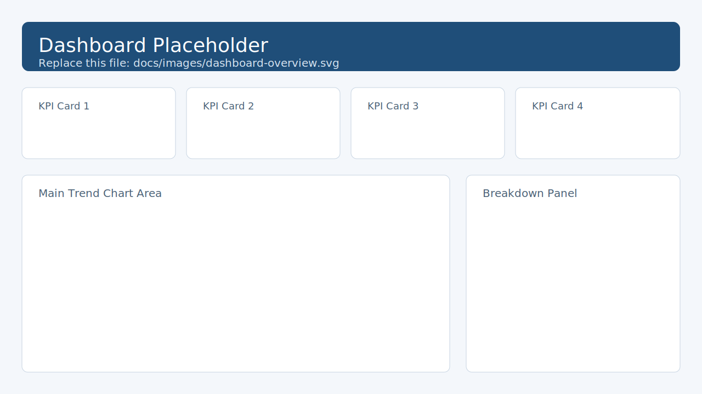
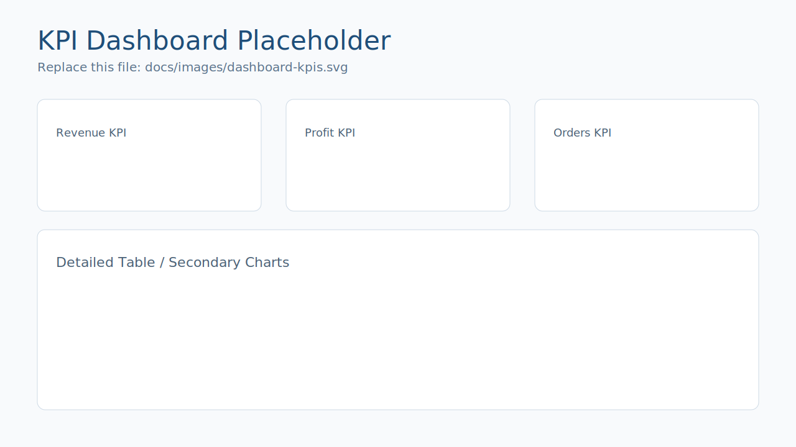
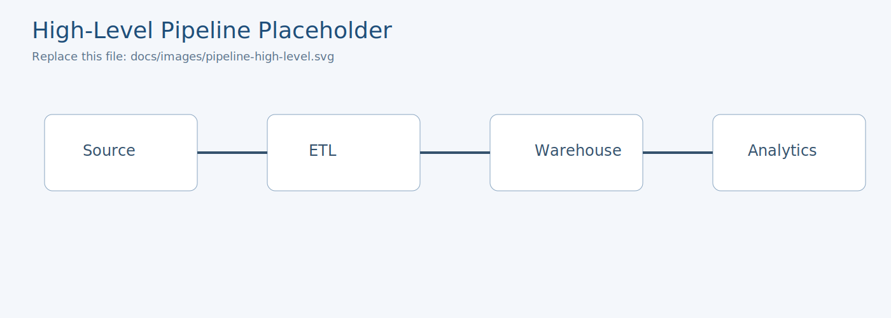
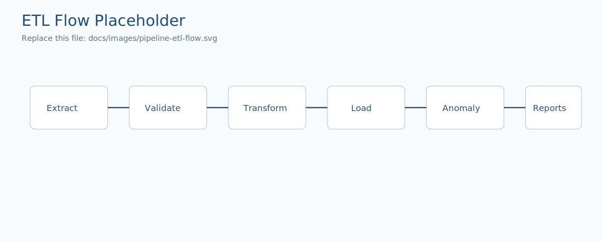
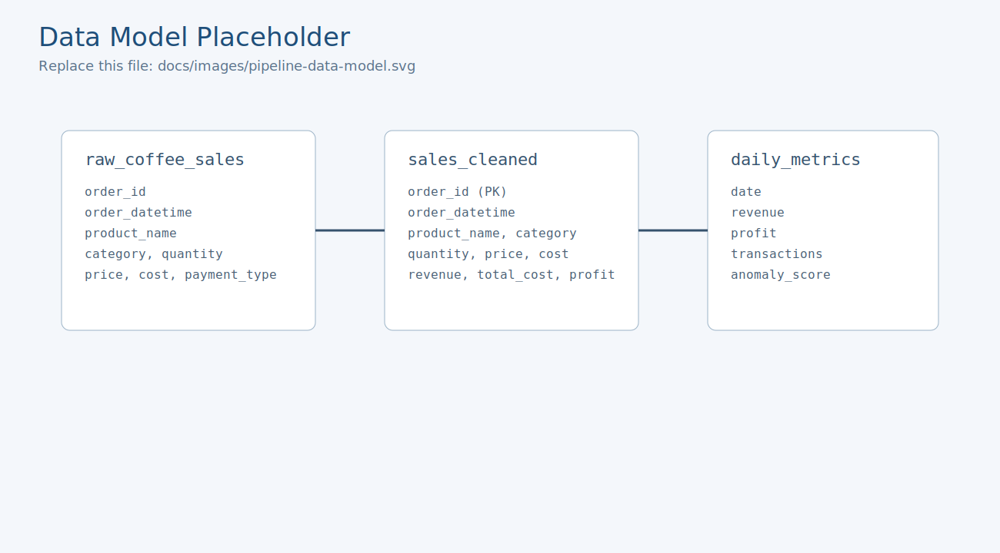

# Coffee Sales ETL Pipeline

Production-style ETL workflow for coffee retail sales data.  
The project ingests daily transactions, validates schema and quality, loads curated data into MySQL, detects anomalies, and publishes visual/reporting outputs.

## Key Capabilities
- Automated daily data backfill to keep the source dataset current
- Schema checks before transform and data-quality reporting after transform
- MySQL upsert load strategy for idempotent reruns
- Daily anomaly detection across revenue, profit, transactions, and margin
- Auto-generated dashboard image and executive PDF report

## Architecture
```text
CSV Source -> Extract -> Schema Validation -> Transform -> Data Validation
          -> MySQL (sales_cleaned) -> Anomaly Detection -> Dashboard + PDF Report
```

## Dashboard & Pipeline Visuals

### Dashboard Placeholders



### Pipeline Placeholders




Replace any file in `docs/images/` with your real screenshots/diagrams using the same filenames to keep links unchanged.

## Repository Layout
```text
.
|- analytics/    # anomaly detection, dashboard, PDF reporting
|- data/         # raw data + daily synthetic data generator
|- etl/          # extract, transform, validate, load
|- logs/         # runtime logs
|- reports/      # generated dashboards, charts, validation JSON, PDF
|- utils/        # logging, DB engine, CLI formatting helpers
|- config.py     # source and database configuration
|- main.py       # pipeline entrypoint
|- requirements.txt
```

## Pipeline Stages
1. `ensure_daily_data()` updates `data/raw_coffee_sales.csv` with missing dates.
2. `extract_data()` reads the configured source (`csv`).
3. `validate_schema()` enforces required input columns.
4. `transform_data()` parses datetimes, coerces numerics, filters invalid rows, and derives business metrics.
5. `validate_data()` writes `reports/validation_report.json`.
6. `load_data()` creates `sales_cleaned` if needed and performs batch upserts.
7. `detect_anomalies()` computes anomaly scores on daily aggregates.
8. `generate_dashboard()` writes `reports/dashboard_latest.png`.
9. `generate_pdf_report()` builds `reports/executive_report.pdf`.

## Quick Start

### 1) Create environment
```powershell
python -m venv etl-venv
.\etl-venv\Scripts\Activate.ps1
```

### 2) Install dependencies
```powershell
pip install -r requirements.txt
```

### 3) Configure database
Update `DATABASE_CONFIG` in `config.py`:
- `host`
- `user`
- `password`
- `database`

### 4) Run pipeline
```powershell
python main.py
```

## Generated Artifacts
- `logs/etl.log` - pipeline execution logs
- `reports/validation_report.json` - null counts and row totals
- `reports/dashboard_latest.png` - anomaly-annotated revenue dashboard
- `reports/executive_report.pdf` - KPI and trend executive report
- `reports/revenue_profit_trend.png`, `reports/revenue_by_category.png`, `reports/payment_mix.png` - chart assets used in PDF

## Operational Notes
- Default source mode is CSV (`DATA_SOURCE_TYPE = "csv"`).
- Load step is designed for reruns via upsert semantics.
- `sales_cleaned` table is auto-created when missing.
- Keep secrets out of version control; prefer environment-based config for shared/public deployments.
